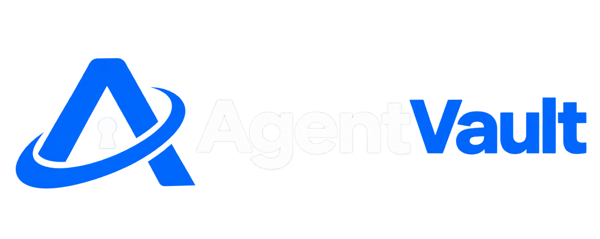

# AgentVault

An autonomous spend controller for AI agents. Each agent gets its own
on-chain balance and a spend policy (daily cap + counterparty allowlist).
When the agent authorizes a payment, AgentTreasury enforces the policy
on-chain, then the backend settles the payment against the counterparty's
own Moove payment link.

Built for the Moove Developer Program.

## How it works

```
AI Agent (own wallet)
      |
      | spend(counterpartyId, amount, requestId)
      v
AgentTreasury.sol  (Base Sepolia)
  - checks: policy exists, counterparty allowed, within daily cap,
    requestId not reused, sufficient balance
  - moves funds: agent balance -> settlementRelayer address
  - emits: SpendExecuted
      |
      v
Backend event listener (ethers.js)
  - resolves counterpartyId -> the counterparty's own Moove payment link id
  - fetches that link's public data (GET /v1/payment-link/{id}, no auth needed)
  - if the link's token+chain match what the treasury holds: relayer sends
    an ERC20 transfer straight to the link's destinationAddress
  - if they don't match: recorded honestly as cross_chain_unsupported —
    Moove Send/Swap/Bridge have no API yet, so there is no live automated
    way to deliver a different asset/chain
      |
      v
Dashboard (React/Vite, terminal-style) polls /agents/:address and
/counterparties, and can trigger a demo spend() from its command line
```

**Why the settlement leg works this way, not as a generic "pay Moove"
call:** Moove's live API today is receive-only — you can create/list your
own payment links, and anyone can read a link's public data with no auth,
but there is no endpoint that lets you tell Moove "pay someone else."
A payment link always settles to its owner's own default wallet. So the
only real, live automation available is: read a counterparty's link,
and if what we're holding already matches what it wants (same token,
same chain), send it directly — which is exactly what Moove's own
checkout does for a same-asset payer, fee-free. Anything cross-chain or
cross-token has no live automated path yet; `mooveClient.ts` reports that
case explicitly rather than faking success.

**Why counterparties are hashed identifiers, not addresses:** a
counterparty may not exist on Base at all — it's reachable only through
whatever chain its own Moove payment link settles on. So the contract
stores `keccak256(identifier)` and the backend keeps the only copy of
which payment link that identifier actually resolves to. This is also
why registering a counterparty is one API call that does two things:
allow it on-chain, and store the link id off-chain.

## Repo layout

```
contracts/   Foundry project — AgentTreasury.sol, tests, deploy script
backend/     Fastify service — admin API, dashboard API, event listener, Moove client
dashboard/   React/Vite terminal-style monitor — single-agent view, live activity log, command line
```

## Running it

### Contracts

```bash
cd contracts
forge test                      # 11 tests should pass

# Deploy to Base Sepolia:
export DEPLOYER_PRIVATE_KEY=...
export SETTLEMENT_TOKEN=...     # USDC address on Base Sepolia
export SETTLEMENT_RELAYER=...   # address the backend controls
forge script script/Deploy.s.sol:Deploy --rpc-url base_sepolia --broadcast
```

### Backend

```bash
cd backend
npm install
cp .env.example .env            # fill in RPC URL, contract address, owner key
npm run dev
```

Register an agent's policy and a counterparty. `moovePaymentLinkId`
accepts either the bare id or the full checkout URL the counterparty
shares from their own Moove dashboard:

```bash
curl -X POST localhost:3000/agents/<agentAddress>/policy \
  -H 'content-type: application/json' \
  -d '{"dailyCap": "100000000"}'   # 100 USDC (6 decimals)

curl -X POST localhost:3000/agents/<agentAddress>/counterparties \
  -H 'content-type: application/json' \
  -d '{"identifier": "provider-a", "moovePaymentLinkId": "https://www.moove.xyz/@provider-a/pay/0c8f2e5a-...", "label": "Provider A"}'
```

Once the agent calls `spend()` on-chain directly (from its own wallet),
the listener picks up the event, looks up that payment link, and settles
it directly if the asset matches.

### Dashboard

```bash
cd dashboard
npm install
cp .env.example .env    # set VITE_AGENT_ADDRESS to the agent you're watching
npm run dev             # http://localhost:5173
```

Type `spend <counterparty-identifier> <amount>` into the terminal's
command line (e.g. `spend provider-a 10`) to trigger a real `spend()`
call from the demo agent wallet — this is what the activity log then
picks up and settles.

## Suggested milestone split (for the Moove application)

1. **Milestone 1** — AgentTreasury deployed to Base Sepolia + policy
   enforcement demo (this repo's current state, once deployed)
2. **Milestone 2** — live settlement demo against a real Moove payment
   link (same-asset path, verified end-to-end with real funds)
3. **Milestone 3** — dashboard UI on top of the existing backend routes;
   cross-chain settlement wired in the moment Moove Send/Swap ships

## Applying to the Moove Developer Program

1. Claim a Moove Handle first — the grant disburses there, so the
   application means nothing without one.
2. Submit via the program's application form (linked from
   moove.xyz/blog/everything-you-need-to-know-about-moove-developer-program),
   with the repo link and the milestone split above.
3. Frame it exactly as this README does: what's live and verified now,
   what's genuinely roadmap-dependent on Moove's side. Every application
   gets a call with the founding team — precision here reads as
   credibility, not hedging.